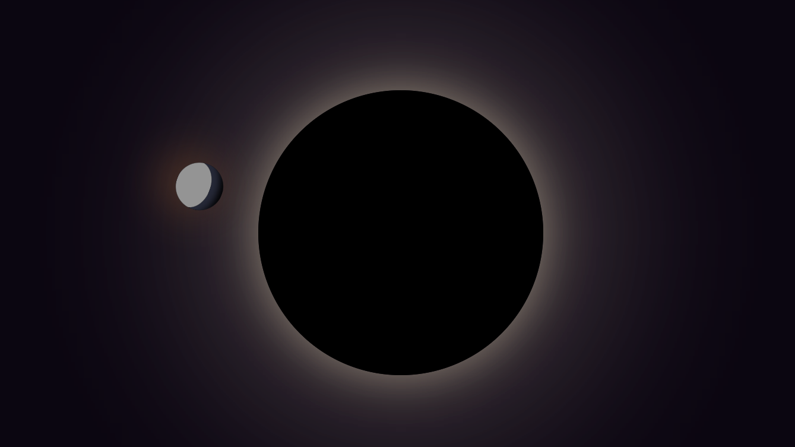

# ```Intrastellar``` (A [Cascade](https://cascade.hackclub.com) project)

## Description

Welcome to the limited space — Intrastellar: Where only the orbits are infinite. This is a minimal version of an orbiting celestial body's (say, a planet's) animation around a larger celestial body (maybe around a star, perhaps).

## Preview



---